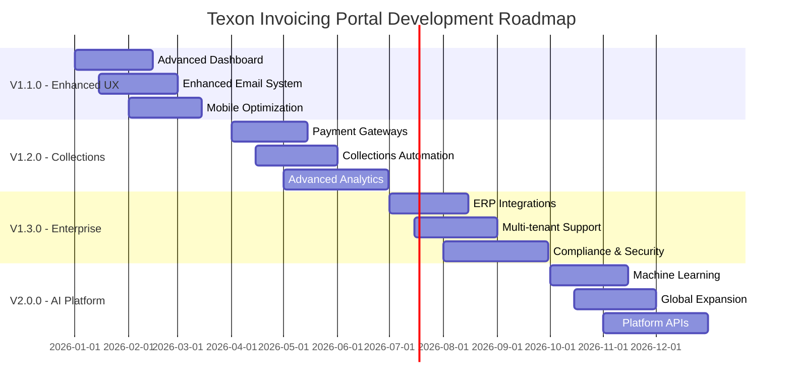

# 🗺️ Texon Invoicing Portal - Product Roadmap

> **Evolving from comprehensive invoice management into an enterprise-grade financial operations platform**

---

## 🎯 **Vision Statement**

Our goal is to evolve the Texon Invoicing Portal from a powerful invoice management and email automation system into a comprehensive **Financial Operations Platform** that provides predictive analytics, automated collections, enterprise-grade reporting, and intelligent customer communication workflows.

---

## 📋 **Release Planning Overview**

| Version | Timeline | Focus Area | Status |
|---------|----------|------------|--------|
| **v1.0.0** | ✅ **Complete** | Core invoicing & email automation | 🟢 Released |
| **v1.1.0** | 🎯 **Q1 2026** | Enhanced UX & advanced reporting | 📋 Planned |
| **v1.2.0** | 🔮 **Q2 2026** | Collections automation & AI insights | 🔮 Future |
| **v1.3.0** | 🔮 **Q3 2026** | Enterprise integrations & multi-tenant | 🔮 Future |
| **v2.0.0** | 🔮 **Q4 2026** | AI-powered financial intelligence | 🔮 Vision |

---

## 🚀 **Version 1.1.0 - Enhanced User Experience**
*Target: Q1 2026*

### 🎯 **Priority Features**

#### **1. Advanced Dashboard & Analytics**
- **🎯 High Priority**
- 📊 **Real-time cash flow dashboard** with visual KPIs
- 📈 **Aging reports visualization** with interactive charts
- 💰 **Revenue forecasting** based on outstanding invoices
- 📉 **Payment trend analysis** and collection performance metrics
- 🔄 **Live invoice status updates** with automatic refresh

#### **2. Enhanced Email System**
- **🎯 High Priority**
- 🎨 **Email template editor** with rich text formatting
- 📧 **Bulk email campaigns** for payment reminders
- ⏰ **Scheduled email sequences** (7-day, 14-day, 30-day reminders)
- 📊 **Email analytics** (open rates, click rates, response tracking)
- 🔄 **A/B testing** for email subject lines and content

#### **3. Improved User Experience**
- **🎯 High Priority**
- 📱 **Mobile-responsive design** with touch-optimized interface
- 🔍 **Advanced search & filtering** across all invoice data
- 📊 **Export capabilities** (Excel, CSV, PDF reports)
- ⌨️ **Keyboard shortcuts** for power users
- 🌙 **Dark mode** support with user preference storage

### 📊 **Success Metrics**
- **User Efficiency**: 50% reduction in time to process reminders
- **Collection Performance**: 20% improvement in payment response rates
- **User Adoption**: 90% daily active user engagement
- **Mobile Usage**: Support for 95% of mobile devices

---

## 🔮 **Version 1.2.0 - Collections Automation**
*Target: Q2 2026*

### 🤖 **Intelligent Collections**
- **🎯 High Priority**
- 🧠 **Smart escalation workflows** based on customer payment history
- 📞 **Automated phone call integration** for high-value overdue accounts
- 💬 **SMS reminder system** for urgent collections
- 🏦 **Payment plan generation** with automated tracking
- 📊 **Customer risk scoring** based on payment patterns

### 🔗 **Payment Processing Enhancements**
- **🎯 High Priority**
- 💳 **Multiple payment gateway support** (Stripe, PayPal, Square)
- 🔄 **Recurring payment automation** for subscription customers
- 💰 **Partial payment tracking** with automatic balance updates
- 📱 **Mobile payment links** with QR code generation
- 🔒 **PCI compliance** implementation and certification

### 📈 **Advanced Reporting & Analytics**
- **🎯 Medium Priority**
- 📊 **Executive dashboards** with C-suite KPIs
- 📈 **Predictive analytics** for cash flow forecasting
- 🎯 **Customer lifetime value** analysis
- 📉 **Churn prediction** based on payment behavior
- 📋 **Compliance reporting** for SOX and other regulations

### 📊 **Success Metrics**
- **Collections Efficiency**: 40% reduction in Days Sales Outstanding (DSO)
- **Payment Speed**: 30% faster average payment collection
- **Automation**: 70% of routine collection tasks automated
- **Customer Satisfaction**: 85% positive feedback on payment experience

---

## 🔮 **Version 1.3.0 - Enterprise Integration**
*Target: Q3 2026*

### 🏢 **ERP & Accounting Integration**
- **🎯 High Priority**
- 🔌 **QuickBooks Online** native integration
- 💼 **Sage Intacct** connection for enterprise accounts
- 📊 **NetSuite** integration for comprehensive financial data
- 🏭 **SAP** connectivity for large enterprise customers
- 🔄 **Real-time data synchronization** across all platforms

### 👥 **Multi-Tenant & Team Management**
- **🎯 High Priority**
- 🏢 **Multi-company support** with data isolation
- 👥 **Advanced user roles** (Collections Manager, Finance Director, etc.)
- 🔐 **Single Sign-On (SSO)** integration with corporate identity providers
- 📊 **Team performance tracking** and individual KPIs
- 🔄 **Approval workflows** for large payment modifications

### 🛡️ **Security & Compliance**
- **🎯 High Priority**
- 📋 **SOC 2 Type II** compliance certification
- 🔒 **Advanced encryption** for all data at rest and in transit
- 📊 **Comprehensive audit trails** with immutable logging
- 🔐 **Multi-factor authentication** mandatory for admin accounts
- 🗂️ **Data retention policies** with automated archival

### 📊 **Success Metrics**
- **Enterprise Adoption**: 10+ enterprise clients onboarded
- **Integration Reliability**: 99.9% uptime for all ERP connections
- **Security**: Zero security incidents or data breaches
- **Compliance**: 100% audit compliance across all frameworks

---

## 🔮 **Version 2.0.0 - AI-Powered Intelligence**
*Target: Q4 2026*

### 🤖 **Artificial Intelligence & Machine Learning**
- **🔮 Future Vision**
- 🧠 **Intelligent payment prediction** using historical data patterns
- 🤖 **Automated dunning strategies** personalized per customer
- 📊 **Dynamic pricing recommendations** based on payment behavior
- 🎯 **Optimal collection timing** using ML algorithms
- 📈 **Market trend analysis** impacting customer payment capacity

### 🌐 **Platform Expansion**
- **🔮 Future Vision**
- 🌍 **Multi-currency support** with real-time exchange rates
- 🗣️ **Multi-language localization** for global operations
- 📊 **Industry-specific templates** (manufacturing, retail, services)
- 🔌 **Open API platform** for third-party developers
- 🏗️ **Microservices architecture** for infinite scalability

### 📱 **Mobile & Modern Interfaces**
- **🔮 Future Vision**
- 📱 **Native mobile apps** for iOS and Android
- 💬 **Voice-activated commands** for hands-free operation
- 🖥️ **Desktop application** with offline capabilities
- ⌚ **Smartwatch notifications** for urgent collections
- 🥽 **VR dashboard** for immersive financial analytics

### 📊 **Success Metrics**
- **AI Accuracy**: 95%+ prediction accuracy for payment behavior
- **Global Reach**: Support for 50+ countries and currencies
- **Platform Adoption**: 1000+ active integrations via API
- **Innovation**: 3+ patents filed for financial AI technology

---

## 🎯 **Priority Matrix**

### **🔥 High Priority - Immediate Business Impact**
1. **Advanced Dashboard** - Real-time visibility into cash flow
2. **Collections Automation** - Reduce manual effort and improve DSO
3. **Payment Processing** - Multiple gateways for customer convenience

### **📈 Medium Priority - Strategic Growth**
1. **Enterprise Integrations** - Enable larger customer acquisition
2. **Advanced Analytics** - Data-driven decision making
3. **Multi-tenant Architecture** - Scale to serve multiple companies

### **🔮 Future Vision - Innovation Leadership**
1. **AI-Powered Insights** - Predictive financial intelligence
2. **Global Platform** - International market expansion
3. **Industry Leadership** - Set new standards for invoice management

---

## 💡 **Quick Wins Implementation**

### **Phase 1: Immediate (2-4 weeks)**
- ✅ **Dashboard KPI cards** showing key financial metrics
- ✅ **Export functionality** for all reports and data
- ✅ **Keyboard shortcuts** for common actions
- ✅ **Dark mode** user interface option
- ✅ **Mobile-optimized** responsive design

### **Phase 2: Short-term (1-2 months)**
- 📧 **Email template customization** with rich editor
- 📊 **Aging report visualization** with interactive charts
- 🔍 **Advanced search** across all invoice and customer data
- ⏰ **Scheduled email campaigns** with template sequences
- 📱 **SMS notification** integration for urgent alerts

### **Phase 3: Medium-term (3-6 months)**
- 🤖 **Basic automation rules** for routine collections
- 💳 **Payment gateway integration** starting with Stripe
- 📈 **Predictive analytics** for cash flow forecasting
- 👥 **Enhanced user management** with role-based permissions
- 🔐 **Advanced security** features and compliance preparation

---

## 🔧 **Technical Debt & Infrastructure**

### **Performance & Scalability**
- 🏎️ **Database optimization** with advanced indexing strategies
- 💾 **Redis caching layer** for frequently accessed data
- ⚖️ **Load balancing** with auto-scaling capabilities
- 🔄 **Background job processing** for heavy operations
- 📊 **Performance monitoring** with real-time alerts

### **Code Quality & Testing**
- 🧪 **Comprehensive test coverage** (unit, integration, E2E)
- 📝 **API documentation** with interactive OpenAPI/Swagger
- 🔍 **Automated code review** with quality gates
- 🏗️ **Microservices refactoring** for better maintainability
- 📦 **CI/CD pipeline** with automated deployments

### **Security & Monitoring**
- 🔒 **Security scanning** integrated into CI/CD pipeline
- 📊 **Application monitoring** with APM tools
- 🚨 **Automated alerting** for system and business metrics
- 💾 **Disaster recovery** with automated backups
- 📋 **Compliance automation** for audit trails

---

## 📊 **Success Measurement Framework**

### **Financial KPIs**
- 📈 **Days Sales Outstanding (DSO)** - Target: 20% reduction
- 💰 **Collection Rate** - Target: 95%+ within 30 days
- 📉 **Bad Debt Ratio** - Target: <2% of total receivables
- ⚡ **Time to Payment** - Target: 40% improvement

### **Operational KPIs**
- 🚀 **User Productivity** - 50% reduction in manual tasks
- 📧 **Email Engagement** - 30% improvement in response rates
- 🎯 **System Reliability** - 99.9% uptime SLA
- 👥 **User Adoption** - 90% active daily usage

### **Customer KPIs**
- 😊 **Customer Satisfaction** - Net Promoter Score 50+
- 🔄 **Payment Experience** - 4.5+ star rating
- 📱 **Mobile Usage** - 60% of interactions on mobile
- ⚡ **Payment Speed** - Average 5-day improvement

---

## 🤝 **Stakeholder Engagement**

### **For Finance Teams**
- 📊 **ROI analysis** and business case validation
- 💼 **Change management** and adoption planning
- 🎯 **Success criteria** definition and measurement
- 📈 **Process optimization** recommendations

### **For IT Departments**
- 🔧 **Technical architecture** review and planning
- 🔐 **Security assessment** and compliance validation
- 🔌 **Integration strategy** with existing systems
- 📊 **Performance testing** and capacity planning

### **For End Users**
- 🧪 **Beta testing** program participation
- 💡 **Feature feedback** and usability testing
- 📚 **Training program** development and delivery
- 🎓 **Best practices** sharing and documentation

---

## 📅 **Development Timeline**

---

## 🎯 **Innovation Areas**

### **Emerging Technologies**
- 🤖 **GPT Integration** for intelligent email composition
- 🔗 **Blockchain** for immutable payment records
- 📊 **Advanced Analytics** with real-time business intelligence
- 🗣️ **Voice AI** for hands-free invoice management
- 🔮 **Predictive Modeling** for customer behavior analysis

### **Industry Trends**
- 💳 **Buy Now, Pay Later** integration for B2B payments
- 🌱 **ESG Reporting** for sustainable business practices
- 🔐 **Zero Trust Security** model implementation
- 📱 **Progressive Web Apps** for offline capabilities
- ⚡ **Real-time Payments** with instant settlement

---

**🚀 Building the Future of Financial Operations**

*From automation to intelligence, transforming how businesses manage their receivables*

**Ready to transform your invoice management?**
*Contact us to discuss your specific needs and timeline*

